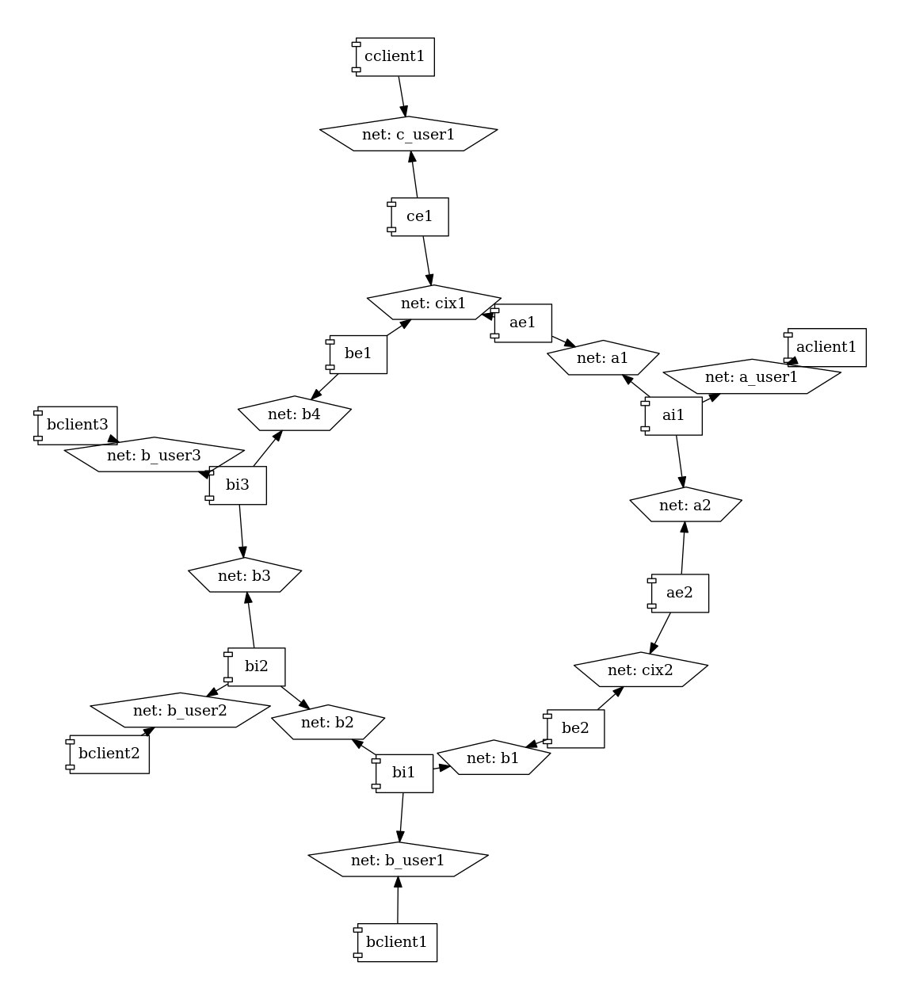

# Experiments with routing protocols

## Easy networks

The folders `rip` and `bgp` contain a small experimental network as docker-compose file.

Run the networks using `docker-compose up`.

It starts the following network:

In RIP, the routing daemons are all configured the same, they communicate over all
network interfaces and update their routing table accordingly.

In BGP the daemons are all configured to communicate with their direct neighbors.

There is also one "client" started ("ab1") that does not run the routing
daemon but can be used to test by adding the routers "a" or "b" as default
route and then pinging "c"-"e".

Note: Since this is a circular net, sometimes RIP and BGP find asymmetric
routes.  That means that packets going from router 1 to router 2 go another way
than packets going from router 2 to router 1. Linux filters packets arriving
from the "wrong" interface by default. This is why we set the sysctl
net.ipv4.conf.all.rp_filter to 2 for all networks namespaces to allow
asymmetric routes. See
https://www.theurbanpenguin.com/rp_filter-and-lpic-3-linux-security/ for
details.

## Internet I

The folder `internet` contains an experiment that is a bit like the real internet:

This is three ISPs "a", "b" and "c" and two internet exchanges "cix1" and "cix2".

The ISP "c" is small and only has one client/customer network that is attached directly to the border gateway "ce1". It only peers over the CIX "cix1".

The ISPs "a" and "b" both have internal routers ("ai1", "bi1", ...) that attach to the border gateways and the client networks. Please note that the BGP-configuration for both "a" and "b" prohibits exporting the internal network ranges as well as importing their own customers ranges. The former prevents accidental access to internal networks for outsiders, the latter prevents the costly situation of routing your own traffic through the internet when your internal network breaks.

Both internet exchanges ("cix1" and "cix2") are not very well equiped and have no route server. Adding a new peer to either network would mean reconfiguring all attached routers.

I will be building a CIX with routing server next.

## Internet II

The folder `internet2` is that experiment where "cix1" has installed a route server.

Read here about route servers: https://www.cisco.com/c/en/us/td/docs/ios-xml/ios/iproute_bgp/configuration/15-mt/irg-15-mt-book/irg-route-server.html

I had not expected that the route server would have to be configured with each peer, I had hoped for a system where you could just connect to the route server and peering would be set up. But that's probably not important for how CIXe usually operate...

To setup a route server, you could use https://arouteserver.readthedocs.io/en/latest/index.html which seems to automagically do some of the necessary configuration for bigger CIXen.

Next up: Anycast.

# Plots

To plot the network as it is defined in the `docker-compose.yml`: `docker run --rm -it --name dcv -v %CD%:/input pmsipilot/docker-compose-viz render -m image docker-compose.yml`

To get a graphviz file of the network routes, use the `./plot` script. It generates a plot like this:

Each router is shown as an ellipse with all its IP addresses and arrows point to routers, annotated by the prefix being routed that way.

In this example you can actually see a routing asymmetry: If "a" would like to send a packet to `172.20.2.2` ("c") the packet would go "a"->"e"->"d"->"c" with a source address of `172.20.4.2`. But "c" routes packets to `172.20.4.0/24` to "b" which sends them on to "a". Without deactivating the reverse path filter, "c" would not even accept the packets coming from "d" bearing a source that "should" not be coming from that direction. With the filters disabled, the ping requests will go "a"->"e"->"d"->"c" and the replies will go "c"->"b"->"a", so the ping will in fact circle the network.
