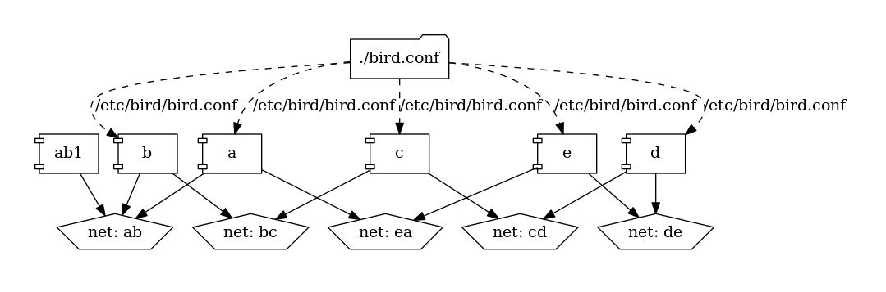
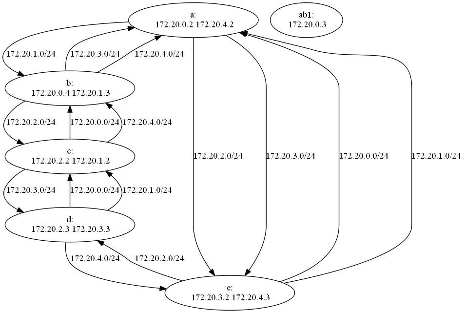

# RIP routing protocol

With this protocol, router broadcast their routing table to other routers on
request. The routing tables are updated if a shorter path (counted by hops) is
received.

Run this using `docker-compose up`.

It starts the following network:

The routing daemons are all configured the same, they communicate over all
network interfaces and update their routing table accordingly.

There is also one "client" started ("ab1") that does not run the routing
daemon but can be used to test by adding the routers "a" or "b" as default
route and then pinging "c"-"e".

Note: Since this is a circular net, sometimes RIP finds asymmetric routes.
That means that packets going from router 1 to router 2 go another way than
packets going from router 2 to router 1. Linux filters packets arriving from
the "wrong" interface by default. Run `echo 2 >
/proc/sys/net/ipv4/conf/all/rp_filter` in all network namespaces
(privileged!) to allow asymmetric routes. See https://www.theurbanpenguin.com/rp_filter-and-lpic-3-linux-security/ for details.

## Plots

To plot the network as it is defined in the `docker-compose.yml`: `docker run --rm -it --name dcv -v %CD%:/input pmsipilot/docker-compose-viz render -m image docker-compose.yml`

To get a graphviz file of the network routes, use the `./plot` script. It generates a plot like this:

Each router is shown as an ellipse with all its IP addresses and arrows point to routers, annotated by the prefix being routed that way.

In this example you can actually see a routing asymmetry: If "a" would like to send a packet to `172.20.2.2` ("c") the packet would go "a"->"e"->"d"->"c" with a source address of `172.20.4.2`. But "c" routes packets to `172.20.4.0/24` to "b" which sends them on to "a". Without deactivating the reverse path filter, "c" would not even accept the packets coming from "d" bearing a source that "should" not be coming from that direction. With the filters disabled, the ping requests will go "a"->"e"->"d"->"c" and the replies will go "c"->"b"->"a", so the ping will in fact circle the network.
